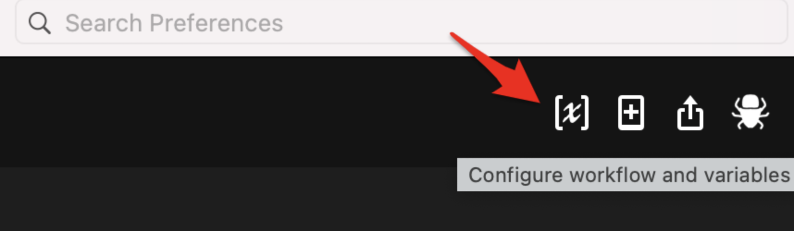

# alfred-yaanki
(yet another anki app)

### An [Alfred](https://www.alfredapp.com/) workflow to interact with your [Anki](https://apps.ankiweb.net) cards  

<a href="https://github.com/giovannicoppola/alfred-yaanki/releases/latest/">
 
</a>

<!-- MarkdownTOC autolink="true" bracket="round" depth="3" autoanchor="true" -->

- [Motivation](#motivation)
- [Setting up](#setting-up)
- [Basic Usage](#usage)
- [Known Issues](#known-issues)
- [Acknowledgments](#acknowledgments)
- [Changelog](#changelog)
- [Feedback](#feedback)

<!-- /MarkdownTOC -->

# Motivation 
- **Search** ability to quickly check a card from any anki deck (searching both sides of cards), even if it is not scheduled for review. 
    - Once reviewed, I would like to indicate outcome and get credit for review
- **Create** ability to quickly create cards from alfred. most of the cards I use every day are one-liners. This might not work for cards with complex text, media etc
    - Delete cards
    - Edit cards
- **Study** ability to review scheduled cards ('study') using Alfred. 

# 1. Setting up
### Needed

- Alfred with Powerpack license
- Python3 (howto [here](https://www.freecodecamp.org/news/python-version-on-mac-update/))
- Some [Anki](https://apps.ankiweb.net) decks

### Default settings
1. Anki directory (default: `~/Library/Application Support/Anki2/User 1/collection.anki2`)
2. In Alfred, open the 'Configure Workflow and Variables' window in `alfred-ticker` preferences
	
	
	- _Optional:_ set the emoji you want to show when the ticker is down (`SYMBOL_DOWN`, default: ⬇️) or up (`SYMBOL_UP`, default: ⬆️)
	- _Optional:_ set your watch list variable `WATCHLIST` (comma-separated list of ticker symbols)
	- _Optional:_ Setup a hotkey to launch alfred-ticker
	- _Optional:_ Change the keyword to launch alfred-ticker (currently set to `!t`)

# Basic Usage 
## Searching and studying cards
Upon opening, yaanki

## Adding new cards

# Limitations & Known issues 
- only works with one-line text cards
- scheduling algorithm is reverse-engineered and simplified, although some default scheduling options can be set by the user. No 'fuzz factor' delays in review not taken into account etc. It works for my purposes, but I haven't tested all use cases. 
- limited to one deck (but can be switched, same as anki app)
- will not work while anki app is open  
- only 3 ease level options when studying:
    - Hard (60 sec)
    - OK (10 min)
    - piece of cake (4 days)
- hidden fields in cards (e.g. ID)are currently shown if present in the template
- features I don't use
    - sub-decks
    - currently all the fields beyond the first (front of the card) are joined in one (reverse). this can be changed  

# Acknowledgments

- [Dean Jackson](https://github.com/deanishe) and [Vitor Galvão](https://github.com/vitorgalvao) for their incredible help on the Alfred mailing list. 
- drlulz for collecting some tools
- benjamin gray for simple query script
- https://github.com/kerrickstaley/genanki/blob/fc8148ab5cabeb16e8957ebb3e7d8ec48bed7cf5/genanki/util.py for the gUId, modelID
- Anki logo from papyrus apps (https://icon-icons.com/icon/anki/93962)

# Changelog

- 09-17-2021: version 1.0

# Feedback

Feedback welcome! If you notice a bug, or have ideas for new features, please feel free to get in touch either here, or on the [Alfred](https://www.alfredforum.com) forum. 
